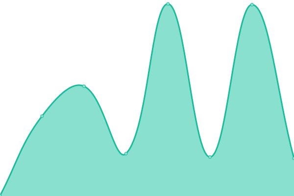
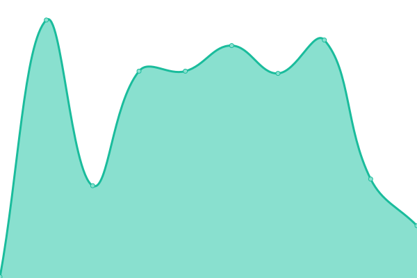
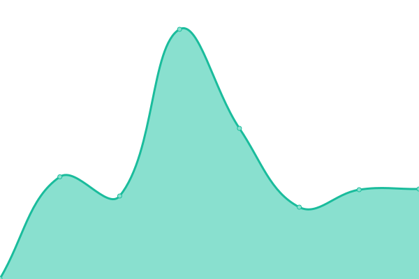

# [📈 Live Status](https://Sotatek-TuLe2.github.io/upptime-demo): <!--live status--> **🟩 All systems operational**

This repository contains the open-source uptime monitor and status page for [Sotatek-TuLe2](https://Sotatek-TuLe2.github.io/upptime-demo), powered by [Upptime](https://github.com/upptime/upptime).

With [Upptime](https://upptime.js.org), you can get your own unlimited and free uptime monitor and status page, powered entirely by a GitHub repository. We use [Issues](https://github.com/Sotatek-TuLe2/upptime-demo/issues) as incident reports, [Actions](https://github.com/Sotatek-TuLe2/upptime-demo/actions) as uptime monitors, and [Pages](https://Sotatek-TuLe2.github.io/upptime-demo) for the status page.

<!--start: status pages-->
<!-- This summary is generated by Upptime (https://github.com/upptime/upptime) -->
<!-- Do not edit this manually, your changes will be overwritten -->
<!-- prettier-ignore -->
| URL | Status | History | Response Time | Uptime |
| --- | ------ | ------- | ------------- | ------ |
|  [Google](https://www.google.com) | 🟩 Up | [google.yml](https://github.com/Sotatek-TuLe2/upptime-demo/commits/HEAD/history/google.yml) | 

 107ms
     
 | 

<a href="https://Sotatek-TuLe2.github.io/upptime-demo/history/google">100.00%</a>
    

|  [FB](https://www.facebook.com) | 🟩 Up | [fb.yml](https://github.com/Sotatek-TuLe2/upptime-demo/commits/HEAD/history/fb.yml) | 

 356ms
     
 | 

<a href="https://Sotatek-TuLe2.github.io/upptime-demo/history/fb">100.00%</a>
    

|  [DevOps Performance Test](https://performance.devops.sotatek.works/) | 🟩 Up | [dev-ops-performance-test.yml](https://github.com/Sotatek-TuLe2/upptime-demo/commits/HEAD/history/dev-ops-performance-test.yml) | 

 267ms
     
 | 

<a href="https://Sotatek-TuLe2.github.io/upptime-demo/history/dev-ops-performance-test">79.43%</a>
    

|  [github.com](https://github.com) | 🟩 Up | [github-com.yml](https://github.com/Sotatek-TuLe2/upptime-demo/commits/HEAD/history/github-com.yml) | 

 124ms
     
 | 

<a href="https://Sotatek-TuLe2.github.io/upptime-demo/history/github-com">100.00%</a>
    

|  [AWS](https://aws.amazon.com) | 🟩 Up | [aws.yml](https://github.com/Sotatek-TuLe2/upptime-demo/commits/HEAD/history/aws.yml) | 

 242ms
     
 | 

<a href="https://Sotatek-TuLe2.github.io/upptime-demo/history/aws">100.00%</a>
    

|  [Google Cloud](https://cloud.google.com) | 🟩 Up | [google-cloud.yml](https://github.com/Sotatek-TuLe2/upptime-demo/commits/HEAD/history/google-cloud.yml) | 

 244ms
     
 | 

<a href="https://Sotatek-TuLe2.github.io/upptime-demo/history/google-cloud">100.00%</a>
    

<!--end: status pages-->

[**Visit our status website →**](https://Sotatek-TuLe2.github.io/upptime-demo)

## 📄 License

- Powered by: [Upptime](https://github.com/upptime/upptime)
- Code: [MIT](./LICENSE) © [Anand Chowdhary](https://anandchowdhary.com), supported by [Pabio](https://pabio.com)
- Data in the `./history` directory: [Open Database License](https://opendatacommons.org/licenses/odbl/1-0/)
